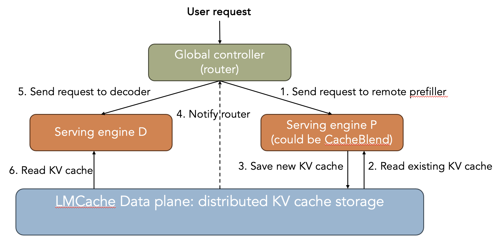

## PD disaggregation in LMCache multiprocess mode



The figure above shows the PD architecture. The workflow goes as:

- The router sends one request to prefill instance with `max_token=1` and then wait for an event.
- The prefill instance finishes storing all the KV caches.
- The `request_telemetry` class reports the finished store event back to the router
- The router then send the request to decode instance.


**NOTE:** the current code only support 1p1d for now.
**NOTE:** the current code is not optimized for perf.

## How to run

Launch the following in 4 different terminal windows

```bash
# LMCache multi-process server
python3 -m lmcache.v1.multiprocess.server --l1-size-gb 100 --eviction-policy LRU
# Prefill instance, enforce_eager for faster startup
LMCACHE_REQUEST_TELEMETRY_TYPE=fastapi LMCACHE_REQUEST_TELEMETRY_ENDPOINT=http://localhost:5768/api/v1/telemetry vllm serve Qwen/Qwen3-14B --kv-transfer-config '{"kv_connector":"LMCacheMPConnector", "kv_role":"kv_both"}' --gpu-memory-utilization 0.7 --no-enable-prefix-caching --enforce-eager --port 8100
# Decode instance, enforce_eager for faster startup
CUDA_VISIBLE_DEVICES=1 vllm serve Qwen/Qwen3-14B --kv-transfer-config '{"kv_connector":"LMCacheMPConnector", "kv_role":"kv_both"}' --gpu-memory-utilization 0.7 --no-enable-prefix-caching --enforce-eager --port 8200
# proxy server
python disagg_proxy_server
```

And then you can test the implementation with example curl request

```
curl -X POST http://localhost:8000/v1/chat/completions \
  -H "Content-Type: application/json" \
  -N \
  -d '{
    "model": "Qwen/Qwen3-14B",
    "messages": [
      {
        "role": "user",
        "content": "1Hello, how are you? I am fine, thank you. But I am not sure about you. Can you tell me more about yourself? I am a human."
      }
    ],
    "max_tokens": 100,
    "temperature": 0.7
  }'
```

Or run some benchmark

```
vllm bench serve \
    --dataset-name random \
    --random-input-len 5000 \
    --random-output-len 100 \
    --request-rate 0.25 \
    --num-prompts 10 \
    --random-range-ratio 0.0 \
    --ignore-eos \
    --backend vllm \
    --model Qwen/Qwen3-14B \
    --port 8000
```